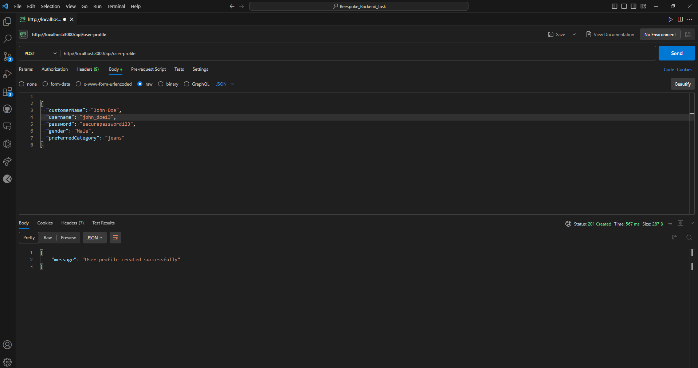
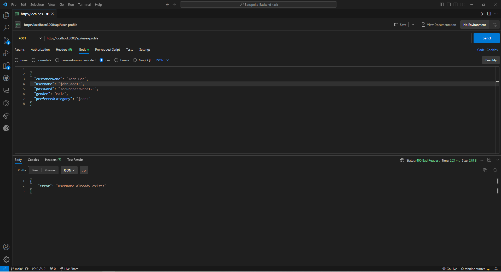
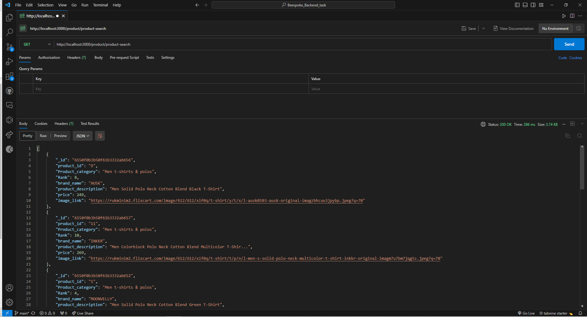
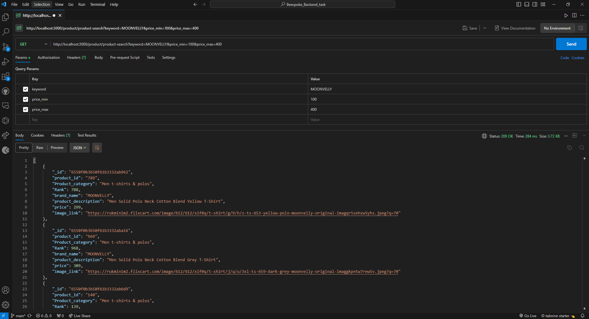

# Beespoke_Backend_task

## Description

This is a `Nodejs ` project that provides APIs for data logging , product search and i used MongoDB to store data.

## Working Features

-  User profile create 
- Product search

## Installation

1. Clone the repo
2. `cd Beespoke_Backend_task`
3. `npm install`
4. Create a `.env` file in the root directory and add the following environment variables
```
//SERVER_PORT

PORT = 3000
MONGO_URL = mongodb+srv://<username>:<password>@cluster0.drr5i1i.mongodb.net/?retryWrites=true&w=majority
```
5. `npm run dev` to start the server in development mode

## API Endpoints
## Endpoint 1
### Method :
- POST


### Endpoint :

- `/api/user-profile`

### Description:
- User profile create and check already existing in database or not.

### Payload :

- `(customerName,username,password,gender,preferredCategory)`


### Response :

- `"message": "User profile created successfully"` || `"error": "Username already exists"`


## Endpoint 2
### Method :
- GET

### Endpoint :
- `/product/product-search?keyword=LOUIS MONARCH`

### Description:
-Product search with keywords and set minimum price and maximum price.

### Payload :

-  `keyword, price_min, price_max`

### Response :
`After the key word search, price range filter is applied and then top 10 products will be returned based on rank`

## output:
### Endpoint 1:




### Endpoint 2:



